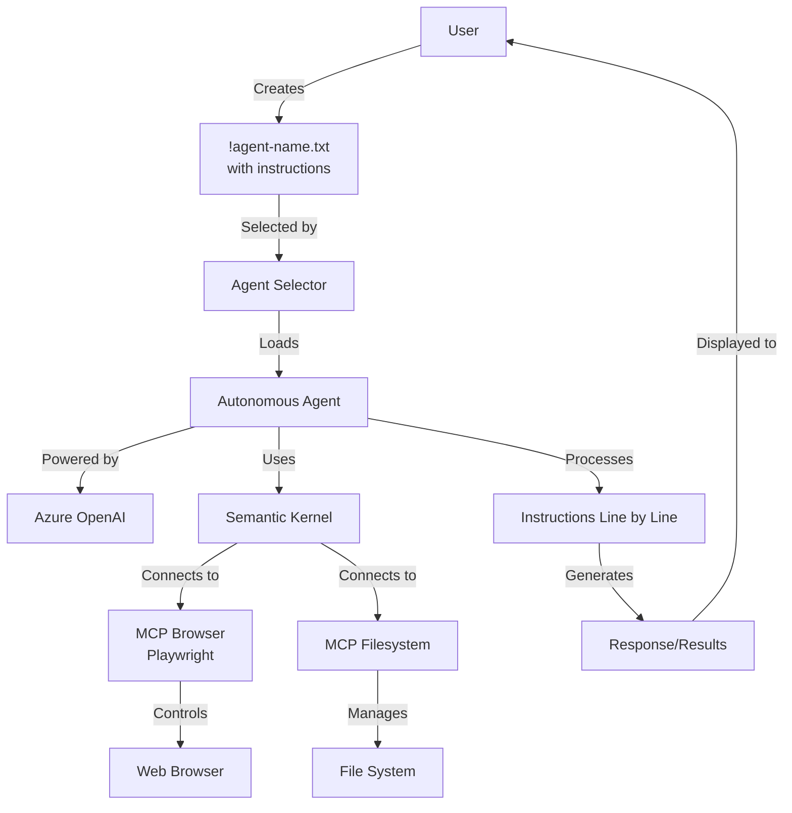

# Autonomous Agents

A powerful demonstration of AI agents that run entirely from plain text instructions - no coding required.

## Overview

This project lets you create autonomous AI agents by simply writing instructions in text files:
- Write plain English commands in a `.txt` file
- Run the application and select your agent
- Watch as it automatically executes your instructions

## Create Your Own Agent in Seconds

1. Create a text file named `!your-agent-name.txt`
2. Write instructions like these examples:
   ```
   Navigate to example.com
   Click on the search button
   Search for "product information"
   Save the results to a file
   ```
3. Run the application and select your agent

## Included Example Agents

- **Stocks Agent**: Researches stocks, analyzes trends, and generates investment reports
- **Shopping Agent**: Searches products on Costco and creates comparison reports

## Why This Matters

- **Zero-Code Automation**: Everything is controlled through simple text files
- **AI-Powered Tasks**: Leverages Azure OpenAI to handle complex research
- **Time Saving**: Automate repetitive tasks with natural language instructions

## How It Works

The system uses Microsoft Semantic Kernel and Model Context Protocol (MCP) to interpret your text instructions and control:
- Web browsers (via Playwright)
- File system operations
- Data analysis and report generation



The process flow:
1. You write instructions in a text file
2. The application loads your selected agent
3. Each instruction is processed through Azure OpenAI
4. The agent automatically uses appropriate tools (browser, filesystem) to complete tasks
5. Results are presented back to you in real-time

## Getting Started

1. Clone this repository
2. Configure your Azure OpenAI API credentials:
   ```
   dotnet user-secrets set "AzureOpenAI:ModelName" "your-deployment-name"
   dotnet user-secrets set "AzureOpenAI:Endpoint" "your-endpoint"
   dotnet user-secrets set "AzureOpenAI:ApiKey" "your-api-key"
   ```
3. Run with `dotnet run` and select an agent

## Requirements

- .NET 9.0+
- Node.js
- Azure OpenAI API access
